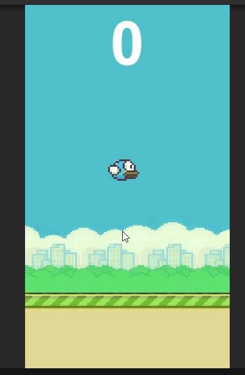

# Flappy-Bird-Clone
Recriando o jogo Flappy Bird
<h2>

Como Executar o Projeto
</h2>

Para executar o jogo é necessário ter instalado em sua máquina:

<ul>
    <li>Game Engine Unity</li>
</ul>
<h2>Imagens do Game</h2>

